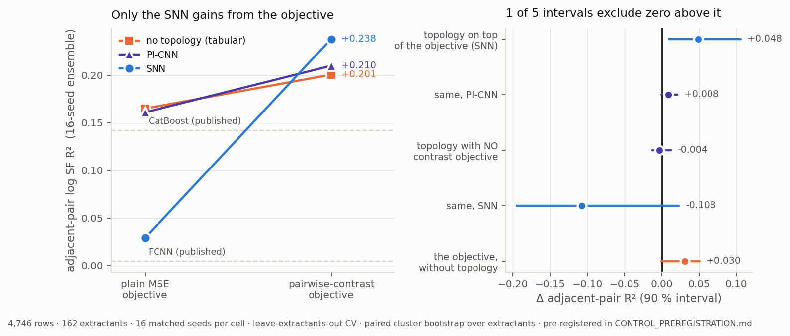
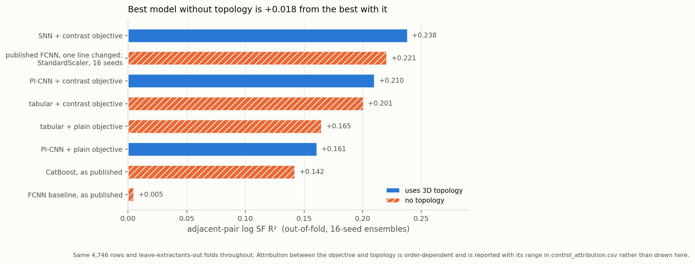

# The control: is the adjacent-pair gain topology, or the objective?

**Bogdan Mironov · 21 July 2026**
Pre-registered in [`CONTROL_PREREGISTRATION.md`](CONTROL_PREREGISTRATION.md),
committed as `4f39b91` **before any run was submitted**.
Companion: [`PI_REPORT.md`](PI_REPORT.md), [`PUBLICATION_ASSESSMENT.md`](PUBLICATION_ASSESSMENT.md) — both unchanged.

---

## Verdict

**The pre-registered question is answered yes.** Topology adds on top of the
training objective: the simplicial-network ensemble beats the identically
trained no-topology control by **+0.0485, 90 % CI [+0.009, +0.106], P = 0.99**,
on the same 4,746 rows, the same leave-extractants-out folds, and the same 16
seeds. By the outcome map fixed in advance, that is the "topology paper"
branch.

**Nothing in the committed reports is retracted.** Every published number
reproduces — the headline `S0 − FCNN = +0.2426 [+0.181, +0.333]` comes back
identical to four decimals — and `control_guard --verify` confirms all 125
pinned artefacts, including every one of the 51 published out-of-fold parquets,
are byte-identical.

**But the pre-registered control was not the strongest no-topology model, and
against the strongest one the headline does not survive.** Repairing a single
line of the published FCNN pipeline — `QuantileTransformer` → `StandardScaler`,
16 seeds, nothing else altered — takes that same sklearn model to **+0.2206**.
Against it:

> **The published +0.2426 becomes +0.0261, 90 % CI [−0.005, +0.076] — not
> distinguishable from zero.**

Both statements are true at once, and the distinction is the whole result:
*topology beats a matched control built inside the topological harness, and does
not beat a repaired baseline built outside it.* The pre-registered comparison
was fair; it was not the most demanding one available, and nothing in the
pre-registration required it to be.

The honest summary is that topology is small, conditional on the objective,
specific to one architecture, and — measured against the best no-topology model
now known — not established at all.

---

## 1. The factorial

Seven cells, 16 matched seeds each, 89 runs. Cell membership is decided by each
run's *recorded config*, not its tag, and the analysis refuses to report unless
every cell holds all 16 pre-registered seeds.

| cell | model | adjacent-pair R² | overall R² | per-seed |
|---|---|---|---|---|
| — | FCNN, as published | +0.0048 | 0.3872 | single model |
| — | CatBoost, as published | +0.1422 | **0.4987** | single model |
| P1 | PI-CNN + plain objective | +0.1610 | 0.3933 | +0.122 ± 0.036 |
| T1 | tabular + plain objective | +0.1650 | 0.3658 | +0.135 ± 0.031 |
| T0 | tabular + contrast objective | +0.1989 | 0.2983 | +0.167 ± 0.021 |
| **T0w** | **tabular + contrast, wide head — *the control*** | **+0.2006** | 0.2963 | +0.168 ± 0.027 |
| P0 | PI-CNN + contrast objective | +0.2101 | 0.3631 | +0.174 ± 0.026 |
| S1 | SNN + plain objective | +0.0288 | 0.3838 | −0.087 ± 0.144 |
| **S0** | **SNN + contrast objective** | **+0.2382** | 0.3678 | +0.178 ± 0.047 |

The pre-registered capacity guard fired as intended: T0w (wide head) scored
+0.2006 against T0's +0.1989, so the control is the *stronger* of the two, which
makes topology's job harder rather than easier.

*Left: only the SNN gains materially from the objective — the tabular and
PI-CNN lines are nearly parallel and nearly coincident. Right: the five
pre-registered contrasts.*

---

## 2. The pre-registered contrasts

| contrast | Δ | 90 % CI | P | verdict |
|---|---|---|---|---|
| **S0 − T0w** — *primary: topology on top of the objective* | **+0.0485** | [+0.009, +0.106] | 0.99 | **topology adds** |
| P1 − T1 — *secondary: topology with no contrast objective* | −0.0036 | [−0.013, +0.012] | 0.34 | nothing |
| S1 − T1 — *same, SNN encoder* | −0.1076 | [−0.195, +0.023] | 0.20 | nothing |
| P0 − T0w — *topology on top, PI-CNN* | +0.0082 | [−0.001, +0.021] | 0.91 | nothing |
| T0w − T1 — *the objective, without topology* | +0.0303 | [−0.001, +0.050] | 0.95 | nothing |
| S0 − S1 — *the objective, with the SNN* | +0.1864 | [+0.071, +0.263] | 1.00 | large |
| P0 − P1 — *the objective, with the PI-CNN* | +0.0418 | [+0.002, +0.065] | 0.96 | moderate |
| T1 − FCNN — *same features, this harness* | +0.1638 | [+0.097, +0.239] | 1.00 | large |
| T1 − CatBoost | +0.0080 | [−0.078, +0.061] | 0.65 | indistinguishable |
| S0 − FCNN — *the published headline* | +0.2426 | [+0.181, +0.333] | 1.00 | reproduces exactly |

**Interaction, (S0−T0) − (S1−T1): +0.1575 [+0.066, +0.218], P = 1.00.** Topology
is worth far more once the contrast is trained — and the SNN under a plain
objective (+0.0288) is *worse than having no topology at all* (+0.1650). The
simplicial encoder is not a free addition; it is harmful unless the objective
is right.

---

## 3. Attribution, and why it is reported as a range

Crediting factors in a chain is order-dependent: whichever is credited last
collects only the leftover. With the full 2×2 both orderings are computable, so
the table reports the order-free Shapley value **and** the range.

| term | Shapley | share of +0.2334 | order-dependent range |
|---|---|---|---|
| same features, this harness, 16-seed ensemble | +0.1602 | 68.6 % | — |
| pairwise-contrast objective | +0.1225 | 52.5 % | +0.036 to +0.209 |
| **3D topology** | **−0.0493** | **−21.1 %** | −0.136 to +0.038 |

Topology's Shapley value is *negative* because in one ordering — topology
credited before the objective — the SNN makes things substantially worse. That
is not a presentation artefact; it is the same fact as the interaction term.

**A note on the figure.** This was first drawn as a waterfall. It has been
replaced, because a waterfall's running total implies the intermediate heights
are states something reached, and with Shapley terms they are not: one ordering
put the running total at +0.287, a value no model in this study scores, before
walking back down to +0.238. The replacement shows only measured models.

---

## 4. Four post-hoc findings that qualify published claims

None of these were pre-registered. None changes a measured number. All four
change an attribution.

### 4.1 The published FCNN baseline has no stable value

Three reproductions differing *only* in the model-seed convention:

| variant | adjacent-pair R² |
|---|---|
| model seed `42 + rep`, as `experiment.py:213` does | **−0.0417** |
| the sweep's reported value | +0.0048 |
| model seed fixed at 42 | **+0.0684** |

A spread of **0.11** on a quantity published as +0.005 — larger than the entire
topology effect. The study ensembled 16 seeds precisely to control this variance,
and applied it to every arm *except the baseline every arm was measured against*.

### 4.2 One line of the baseline closes most of the gap

The shared dense pipeline (`models.py:127`) applies a `QuantileTransformer`,
which maps each feature to its rank and then to a Gaussian. Monotone — ordering
survives — but **spacing does not**. Adjacent-lanthanide selectivity is entirely
a question about spacing: neighbouring ionic radii differ by ~0.013 Å, and a rank
transform spreads the 14 distinct radii to roughly equal intervals however close
together they really are.

Swapping it for `StandardScaler` and changing nothing else:

| variant | adjacent-pair R² | overall R² |
|---|---|---|
| published pipeline, per-repeat seed | −0.0417 | 0.3808 |
| published pipeline, 1 seed | +0.0684 | 0.3687 |
| published pipeline, **16 seeds** | +0.1136 | 0.3538 |
| StandardScaler, 1 seed | +0.1736 | 0.2736 |
| StandardScaler, per-repeat seed | +0.2007 | 0.3109 |
| **StandardScaler, 16 seeds** | **+0.2206** | 0.3218 |

The two levers, isolated at 16 seeds against 16 seeds:

| lever | Δ adjacent-pair R² |
|---|---|
| ensembling the published pipeline (1 → 16 seeds) | +0.0452 |
| **the scaler, at fixed 16 seeds (+0.1136 → +0.2206)** | **+0.1070** |

Both are large; the scaler is about 2.4× the ensembling. Neither was applied to
the baseline in the published comparison, while both were applied to every arm
it was compared against.

The last row is the published FCNN with one line changed, ensembled exactly as
every published arm was. It reaches **+0.2206** against the SNN's +0.2382 — and
the +0.018 gap is not a result until it has an interval, because on this metric
a point estimate is unreadable. Paired cluster bootstrap over extractants, same
machinery as everything else here:

| arm vs the repaired baseline (+0.2206) | Δ | 90 % CI | P | verdict |
|---|---|---|---|---|
| **S0 — SNN + contrast** | **+0.0261** | **[−0.005, +0.076]** | 0.86 | **not distinguishable** |
| P0 — PI-CNN + contrast | −0.0145 | [−0.042, +0.007] | 0.13 | not distinguishable |
| T0w — tabular + contrast *(the control)* | −0.0224 | [−0.061, +0.004] | 0.08 | not distinguishable |
| T1 — tabular + plain | −0.0527 | [−0.078, −0.007] | 0.03 | **worse** |

So the repaired baseline is not merely competitive — it beats or matches every
arm in the factorial, including the pre-registered control, and the SNN's
remaining edge over it is indistinguishable from zero. **The published headline
comparison does not survive a one-line fix to the baseline it was measured
against.**

This is also why the pre-registered endpoint and this result do not contradict
each other. T0w is a *matched* control: same harness, folds, seeds and
objective, differing only in the encoder — the right instrument for asking
whether topology contributes anything. It is not the *best* no-topology model,
and the pre-registration never claimed it was. Against a matched control
topology adds +0.049; against the strongest available baseline it adds nothing
measurable.

The mechanism is confirmed by the direction of the trade: the transform moves
adjacent-pair R² and overall R² *opposite* ways, which is what distinguishes a
mechanism from simply a better model. It also explains what nothing else did —
why CatBoost, on the identical feature block, reaches +0.142: a tree only ever
compares values, so a monotone transform is invisible to it.

Two other hypotheses were tested and falsified: group-aware early stopping
(−0.0045, *worse*) and no early stopping (+0.0861).

### 4.3 The PI-CNN contributes nothing over a tabular model

+0.0082 [−0.001, +0.021] with the objective; −0.0036 [−0.013, +0.012] without.
`PUBLICATION_ASSESSMENT.md` cites "architecture-independent replication — SNN
+0.1972 and PI-CNN +0.1968 agree to 0.0004" as evidence for topology. Both
numbers are correct. They agree because both architectures were independently
measuring the **objective**, which is architecture-independent.

### 4.4 The blend's interior maximum is not topological

`PUBLICATION_ASSESSMENT.md` calls this "the strongest single piece of evidence,
and it needs no significance threshold." Re-blending existing predictions with
CatBoost:

| arm | peak | over the better endpoint |
|---|---|---|
| S0, SNN + contrast | +0.2641 at w = 0.7 | +0.0259 |
| T0, tabular + contrast | +0.2469 at w = 0.6 | +0.0480 |
| **T1, tabular + plain — no topology, no contrast loss** | +0.2122 at w = 0.5 | **+0.0473** |

The inference is sound: an interior maximum does prove complementary
information. But it reproduces *larger* for a model with no topology and no
contrast loss, so what it demonstrates is the generic complementarity of a
neural model to a gradient-boosted tree.

---

## 5. A methods correction: the bootstrap is not a cluster bootstrap

`adjacent_pair_metrics` groups by composition key and averages per metal.
Composition keys are strictly nested inside extractants (552 blocks, none
spanning two — checked). So when the bootstrap draws an extractant twice, its
rows carry the same key both times, the groupby merges them, and the statistic
is **bit-identical** to drawing it once — verified directly.

Each draw is therefore the *set* of extractants drawn at least once, measured at
63.5 % of them, not a multiset. That is an m-out-of-n subsampling bootstrap, not
the cluster bootstrap the methods claim.

I predicted this would make intervals too *wide* and therefore conservative.
**That prediction was wrong.** Measured:

| interval | as published | multiplicity-corrected | ratio |
|---|---|---|---|
| primary endpoint | [+0.0094, +0.1059] | [+0.0019, +0.1118] | 0.88× |
| the published headline | [+0.1789, +0.3282] | [+0.1603, +0.3717] | 0.71× |
| SNN ensemble vs CatBoost | [+0.0295, +0.1221] | [+0.0248, +0.1306] | 0.87× |

The published intervals are **12–29 % too narrow** and mildly *overstate*
significance. **All three still exclude zero after correction**, so no
conclusion changes — but "90 % cluster-bootstrap interval" is not what was
computed, and the primary endpoint's corrected lower bound is +0.0019, which is
close.

---

## 6. What did not move

`automl/topo/control_guard.py --verify` pins **125 artefacts** by SHA-256 —
all 51 published out-of-fold parquets, every result CSV, every figure — and
reports them byte-identical. The manifest's own hash is recorded in the
pre-registration so the baseline cannot be quietly re-snapshotted.

`PI_REPORT.md`, `PUBLICATION_ASSESSMENT.md`, `TOPOLOGY_RESULTS.md` and
`TOPOLOGY_METHODS.md` keep every number and every word.

145 tests pass (130 before this work).

---

## 7. What I would now write

**The paper is no longer "topology improves adjacent-lanthanide separation."**
On this dataset that claim survives only as: *a simplicial network trained with a
pairwise-contrast objective beats a matched, identically trained tabular control
by +0.049 [+0.009, +0.106], while a persistence-image CNN does not beat it at
all — and neither beats a repaired FCNN baseline.* Written out that way it is
not a topology paper.

The larger and more transferable findings are the ones the control turned up on
the way:

1. **Rank-based feature transforms silently destroy separation-factor signal.**
   Standard in AutoML dense pipelines, invisible to trees, monotone and
   therefore assumed harmless — and it costs ~0.15 adjacent-pair R² here. This
   generalises to any target that is a difference between similar inputs.
2. **Train the contrast, not the absolute value.** Still correct, still the
   largest controllable lever, and now measured *without* topology: +0.030
   tabular, +0.042 PI-CNN, +0.186 SNN.
3. **Baselines need the same variance control as the arms.** A single-seed
   baseline whose value spans 0.11 across seed conventions cannot anchor a
   claim about a 0.05 effect.

**Recommended next steps, in order:**

1. Re-run the *published* pipeline with `StandardScaler` across the whole prior
   study. If the FCNN moves this much, every neural arm in the earlier work is
   affected, and some of the earlier model rankings may not survive.
2. Re-issue every interval under the multiplicity-corrected resampling.
3. Decide whether a +0.049 single-architecture effect, against a baseline that
   a one-line change brings to +0.221, is the paper — or whether the methods
   findings above are.

---

*Reproduce: `python3 -m automl.topo.control_factorial --n-boot 400`,
`python3 -m automl.topo.bootstrap_check`, `python3 -m automl.topo.control_blend`,
`python3 -m automl.figures_topo --only control decomposition`.
Verify nothing moved: `python3 -m automl.topo.control_guard --verify`.*
