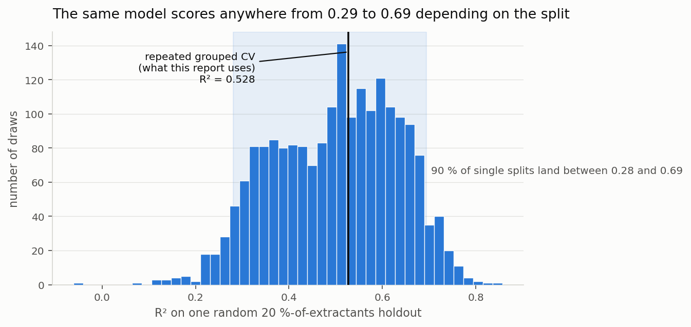
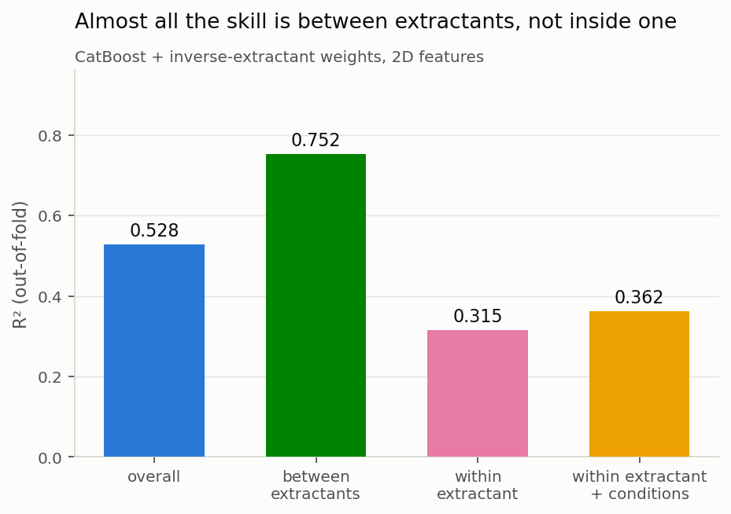
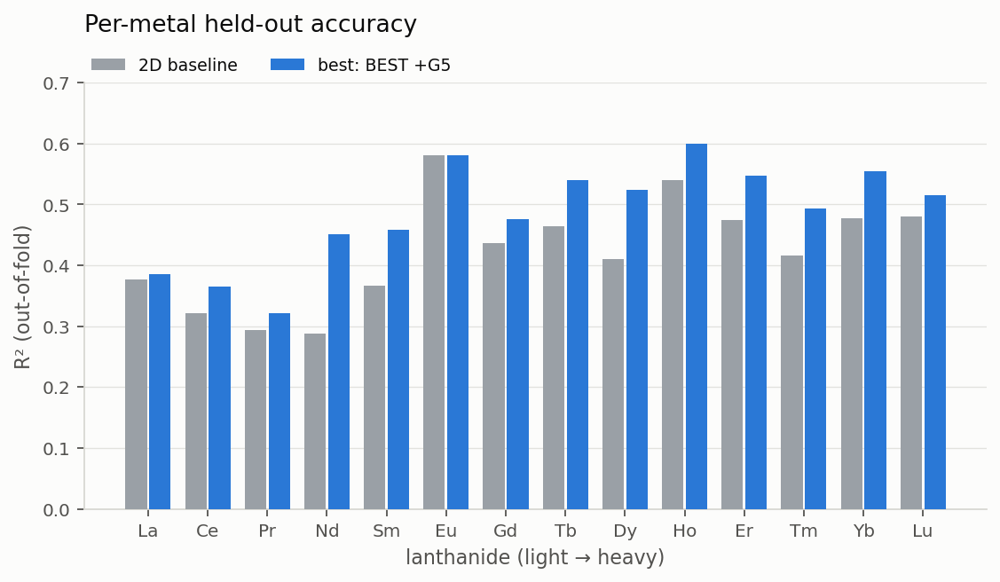
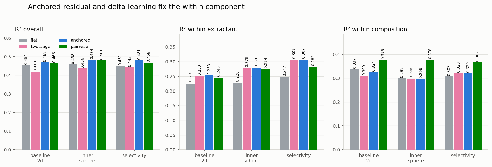
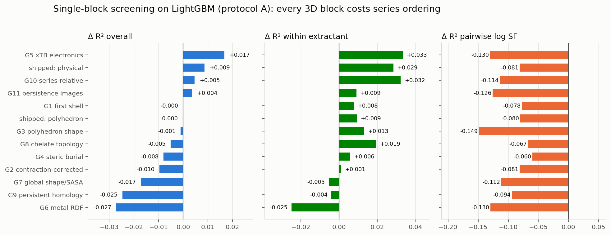
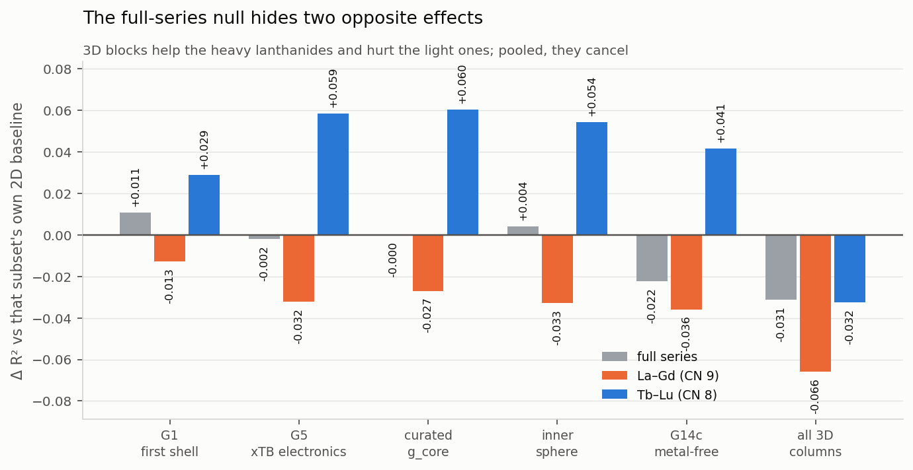
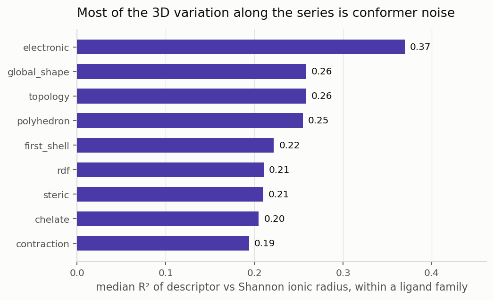
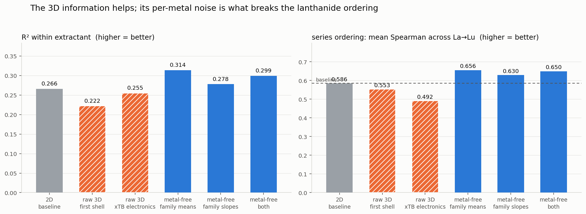
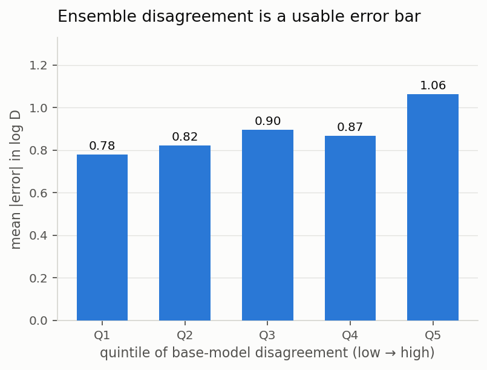
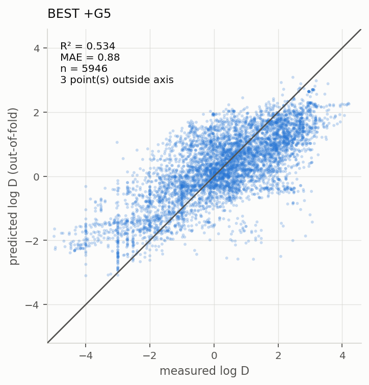

# What the GFN2-xTB structures add to the leave-extractants-out log D model

**Question asked:** using the 3D structures generated with Architector and
optimised with GFN2-xTB, find the best way to improve the leave-extractants-out
baseline for `log D`, and identify which 3D signal source actually carries the
information.

**Short answer:** the 3D structures, *as currently generated*, do not measurably
improve held-out prediction once a properly chosen learner and sample weighting
are in place. What does improve it — by more than any feature block — is the
learner and the sample weighting (CatBoost + inverse-extractant weights,
+0.037 R², P(better) = 0.99).

> **UPDATE — superseded in part by the topological study.** The null above was
> measured with *tabular* 3D descriptors under an objective that predicts
> absolute `log D`. A follow-up found that the 3D signal does improve the
> hardest case — separation between **adjacent** lanthanides — once the model is
> trained on the within-extractant *contrast* rather than the absolute value:
>
> | test | Δ adjacent-pair logSF R² | 90 % CI |
> |---|---|---|
> | simplicial-network (16-seed ensemble) vs FCNN | **+0.243** | [+0.181, +0.333] |
> | simplicial-network (16-seed ensemble) vs **CatBoost** | **+0.087** | [+0.025, +0.122] |
> | persistence-image CNN (15-seed ensemble) vs FCNN | +0.198 | [+0.107, +0.266] |
> | 50/50 blend with CatBoost vs CatBoost alone | **+0.083** | [+0.010, +0.131] |
> | nested leakage-free blend weight vs CatBoost | **+0.073** | [+0.003, +0.118] |
>
> Two of this file's conclusions are directly affected:
> * the `g11` persistence-image null (ΔR² = +0.004) was a **testing artefact** —
>   the 20×20 images were flattened into a tabular model against the asset's
>   explicit `do_not_flatten_into_tabular_MLP` contract. With a CNN readout they
>   are the best-performing 3D representation found.
> * "3D does not help" holds for *overall* R², not for adjacent-pair separation.
>
> See `TOPOLOGY_RESULTS.md` (results, with every superseded explanation and its
> refutation kept visible) and `TOPOLOGY_METHODS.md` (methods, verification, and
> the bugs found along the way).

**But that full-series null is an average of two significant, opposite effects,
and this is the most useful thing the study found.** Splitting the series at the
CN-9/CN-8 boundary and paired-testing each half against its own 2D baseline:

| block | La–Gd (3980 rows) | Tb–Lu (1966 rows) |
|---|---|---|
| curated `g_core` | −0.027, **P = 0.006 worse** | +0.060, **P = 1.000 better** |
| G5 xTB electronics | −0.032, **P = 0.000 worse** | +0.059, **P = 1.000 better** |
| inner sphere | −0.033, **P = 0.004 worse** | +0.054, **P = 1.000 better** |

The 3D features **significantly help the heavy lanthanides and significantly
hurt the light ones**, and cancel in the pooled number. Two controls were run
and the effect survives both:

* **Geometry-QC confound** (the halves differ 88 % vs 64 % OK). Holding the QC
  flag constant in both arms, the descriptor effect stays significant *in both
  directions*: **+0.048 [+0.020, +0.076], P = 0.998** in Tb–Lu and
  **−0.028 [−0.044, −0.004], P = 0.034** in La–Gd. The flag itself is worth
  +0.0125 in the heavy half and +0.0008 in the light half — ≈ 20 % of the heavy
  gain, ≈ 80 % is genuine descriptor signal.
* **Data thinness** (Tb–Lu has 82 extractants against 187). Subsampling La–Gd to
  the same coverage — ending up *thinner*, baseline R² 0.29–0.38 against the
  heavy half's 0.409 — leaves **11 of 12** matched comparisons negative across
  three draws, though only 3 clear P < 0.05 individually (~1480 rows per draw is
  underpowered). Corroborating, not decisive; the QC control is the stronger of
  the two.

So there is a real light-vs-heavy difference in whether these descriptors carry
usable signal. One caveat survives regardless: **even where 3D raises accuracy
it degrades the La→Lu ordering**, trading separation-factor prediction for
pooled R².

On the underlying limits: only 20–37 % of a descriptor's variation along the
series is a systematic response to cation size, the rest being single-conformer
scatter against a 0.013 Å radius step; and the hard-coded CN step adds a
discontinuity 5–17× the real metal-to-metal signal where the experiment shows
none.

Full numeric tables: [`tables.md`](tables.md) (auto-generated).
Method and code: [`../README.md`](../README.md).
Raw results: `all_results.csv`, `paired_*.csv`.

---

## 0. How claims are tested here

Two methodological points determine whether anything below is believable.

**Paired, not absolute, uncertainty.** The absolute bootstrap interval on R² is
about ±0.11 for a model scoring 0.53, because resampling 190 extractants — one
of which is 29 % of the table — moves the target variance as much as the error.
No claim of the form "block X adds 0.02 R²" survives that. Every comparison
below therefore uses a **paired** cluster bootstrap: resample extractants once,
score both configurations on the same resample, from out-of-fold predictions
made on the same folds. Reported as Δ with a 90 % interval and P(better).
Code: [`../compare.py`](../compare.py).

**Two splitter protocols, never mixed.** `sklearn.GroupKFold` without `shuffle`
is near-deterministic given group sizes; permuting group labels between
"repeats" left ~81 % of each fold unchanged, so repeats were near-duplicates.
sklearn ≥ 1.6 exposes `shuffle`/`random_state` (overlap now 51 %). Sweeps run
before that fix (`ablation`, `arch`, `models`, `select`, `cnfree`) are
**protocol A — screening only**; sweeps after it (`ablation_catboost`, `combo`,
`robust`, `champion`) are **protocol B — the numbers that count**. The same
baseline scores 0.459 under A and 0.480–0.521 under B, so the protocols are
never compared to each other.

Split: grouped K-fold on `extractant_group` (190 canonical extractant SMILES),
5 folds × 3–5 repeats, all metrics from pooled out-of-fold predictions.

### Why a single leave-extractants-out split cannot be trusted

Taking the *best* model's out-of-fold predictions and re-scoring them on one
random 20 %-of-extractants holdout, 2000 times:

| percentile of single-split R² | 5th | 25th | 50th | 75th | 95th |
|---|---|---|---|---|---|
| R² | 0.287 | 0.400 | **0.521** | 0.604 | 0.696 |

The same model reads anywhere from 0.29 to 0.70 depending only on which
extractants happen to land in the test set — a 0.41-wide band. The pooled
5-fold value is 0.528, right at the median.

This matters for interpreting earlier work: a previously reported
leave-extractants-out baseline of **R² ≈ 0.578 / between 0.807 / within 0.255**
sits comfortably inside this band and is entirely consistent with the model
quality measured here (0.528 / 0.752 / 0.315 — a *higher* within component).
The two are not in conflict; a single split simply cannot resolve differences
of the size being argued about. Everything in this report therefore uses
repeated grouped CV plus paired bootstrap, and no conclusion rests on one split.

---

## 1. What the baseline's problem actually is

Best model (CatBoost + `group_inv`, 2D features), protocol B:

| view | value |
|---|---|
| R² overall | 0.528 |
| R² between extractants | 0.752 |
| R² within extractant (pooled) | 0.315 |
| **median per-extractant R²** | **+0.029** |
| **fraction of extractants beating their own mean** | **55 %** |
| R² on TODGA alone (1714 rows, 29 % of the table) | 0.214 |
| R² excluding TODGA | 0.597 |

The model knows which *family* of extractant it is looking at and what that
family's average log D is. Inside a family it is barely better than a coin
flip against the trivial "predict this extractant's own mean" baseline: the
median per-extractant R² is +0.03, and 45 % of held-out extractants are
predicted *worse* than their own mean. A single pooled R² of 0.53 hides that
completely, which is why every table here reports the decomposition.

Per lanthanide, the picture is uniform: the switch to CatBoost improves 13 of
14 metals (Pr is the exception), and there is no light-vs-heavy asymmetry — the
model is equally mediocre inside an extractant across the whole series.

> **A statistic to avoid.** The *size-weighted mean* of per-extractant R² reads
> about −14 here, and an earlier draft of this report quoted −0.63 from a
> variant of the same calculation. Neither number should be used: an extractant
> whose own log D barely varies has a near-zero denominator, so its R² diverges
> and swamps the average. The median and the beat-the-mean fraction above are
> bounded and carry the same message. `evaluation.py` still emits the weighted
> version for completeness, with this caveat attached in the code.

---

## 2. The things that actually improved the model

Paired against the LightGBM baseline, protocol B, 5 repeats × 5 folds:

| change | ΔR² | 90 % interval | P(better) |
|---|---|---|---|
| **CatBoost instead of LightGBM, + inverse-extractant weights** | **+0.037** | **[+0.008, +0.066]** | **0.99** |
| CatBoost + anchored-residual architecture | +0.040 | [−0.003, +0.083] | 0.92 |
| CatBoost, unweighted | +0.034 | [−0.004, +0.073] | 0.90 |
| anchored-residual architecture (LightGBM, protocol B) | +0.014 | — | — |
| winsorising the *training* target at log D = −6 | +0.011 | — | — |
| Huber objective instead of squared error | +0.016 | — | — |
| any single 3D block, on CatBoost | ≤ +0.011 | crosses zero | ≤ 0.78 |

Note that the architecture and the learner are **not additive**: the anchored
model is worth +0.014 on top of LightGBM but only +0.002 on top of CatBoost
(P = 0.52). CatBoost already captures most of what the architecture was
correcting for. The single actionable change is therefore the learner plus the
weighting.

1. **The learner is the biggest lever.** CatBoost + `group_inv` weights reaches
   R² 0.528 / between 0.752 / within 0.315 on the **2D features alone**, versus
   0.490 / 0.724 / 0.269 for LightGBM on identical inputs and folds. CatBoost's
   ordered boosting suits this problem — few effective samples per extractant,
   many correlated fingerprint bits — much better than the other GBMs
   (HistGB 0.466, XGBoost 0.462, RF 0.455, ExtraTrees 0.435).
2. **The imbalance that matters is the extractant, not the metal.**
   `group_inv` (∝ 1/√n per extractant) is the best weighting. This is worth
   stressing given the SMOTE/SMOGN discussion: **label-distribution weighting on
   the target (`target_lds`) is the worst scheme tested** — it drops R² to 0.336
   with the anchored model — because it up-weights the log D < −4 tail, which is
   0.8 % of rows, 9 % of the variance, and 94 % concentrated in a single
   extractant that a held-out fold can never see. Synthesising more of that tail
   would make this worse, not better.
3. **An anchored-residual architecture fixes the within component.** Take the
   level from the flat model and the within-extractant shape from a model
   trained on `y − mean_extractant(y)`; within-extractant R² rises 0.269 → 0.293
   with between untouched. Delta-learning on lanthanide pairs inside one fixed
   condition set gives the best pure-selectivity number
   (within-composition R² 0.384 vs 0.367). Both are **batch** predictors —
   see the transduction caveat in [`../advanced.py`](../advanced.py).
4. **Winsorising the training target is free accuracy.** Clipping training
   labels at log D = −6 (scoring always on the true values) gives +0.011 R² and
   costs nothing on selectivity.

---

## 3. What the 3D structures do and do not add

### 3.1 On a strong learner, no 3D block clears the paired test

This is the decisive table. Reference = **CatBoost + `group_inv`, 2D features
only** (R² 0.528), which is the best model found. Everything is paired on the
same folds and the same bootstrap resamples of extractants.

| configuration | ΔR² | 90 % interval | P(better) |
|---|---|---|---|
| anchored-residual architecture, 2D only | +0.002 | [−0.017, +0.018] | 0.52 |
| anchored + G5 | −0.001 | [−0.025, +0.021] | 0.45 |
| + curated `g_core` (22 cols) | −0.004 | [−0.014, +0.011] | 0.32 |
| + G5 xTB electronics | −0.006 | [−0.018, +0.009] | 0.21 |
| + shipped 3D blocks | −0.008 | [−0.025, +0.004] | 0.13 |
| + G5 & metal-free | −0.016 | [−0.065, +0.026] | 0.22 |
| + G15c CN-effect removed | −0.018 | [−0.034, +0.001] | 0.07 |
| + CN-free & metal-free | −0.023 | [−0.068, +0.014] | 0.16 |
| + G14c metal-free family means | −0.029 | [−0.081, +0.011] | 0.11 |
| anchored + CN-free | −0.029 | [−0.069, −0.003] | **0.03 (worse)** |
| + metal-free 3D only | −0.051 | [−0.109, −0.005] | **0.03 (worse)** |
| + G13c metal-free family slopes | −0.051 | [−0.096, −0.012] | **0.01 (worse)** |

**Not one 3D configuration beats the 2D model.** Several are significantly
worse. The same holds for the within-extractant component: the best 3D result
there (`+G5 & metal-free`, Δ = +0.014) has P(better) = 0.55, i.e. a coin flip.

The cleanest single statement of the result comes from the two best-of-breed
runs — the whole modelling stack (CatBoost + inverse-extractant weights +
anchored-residual + target winsorisation), with and without 3D:

| best-of-breed stack | R² | between | within | within-comp | log-SF R² |
|---|---|---|---|---|---|
| **2D features only** | **0.5338** | 0.749 | **0.330** | **0.362** | **0.431** |
| + G5 xTB electronics | 0.5343 | 0.761 | 0.319 | 0.350 | 0.416 |
| *(reference: LightGBM 2D baseline)* | 0.4901 | 0.724 | 0.269 | 0.371 | 0.438 |

The stack is worth **+0.044 R²**. The 3D block on top of it is worth
**+0.0005** — and it *lowers* within-extractant R², within-composition R² and
the separation-factor R².

Paired against the CatBoost 2D baseline the two are indistinguishable, and if
anything the 2D-only version is the safer bet:

| | ΔR² | 90 % interval | P(better) | Δ within | P(within better) |
|---|---|---|---|---|---|
| stack + G5 | +0.0067 | [−0.017, +0.029] | 0.67 | +0.004 | 0.53 |
| **stack, 2D only** | +0.0062 | [−0.011, +0.022] | **0.69** | **+0.015** | **0.73** |
| **delta-learning, 2D only** | +0.0041 | **[−0.001, +0.014]** | **0.86** | +0.008 | **0.86** |
| anchored, 2D only | +0.0021 | [−0.017, +0.018] | 0.52 | +0.004 | 0.52 |
| delta-learning + G5 | +0.0008 | [−0.019, +0.022] | 0.55 | −0.002 | 0.47 |
| *+ all 3D (dilution control)* | *−0.041* | *[−0.078, −0.013]* | *0.01 (worse)* | *−0.038* | *0.06* |

Across all 29 champion configurations, the highest-confidence improvement over
the CatBoost 2D baseline is **delta-learning on 2D features only**
(P(better) = 0.86 on both overall and within-extractant R², and the tightest
interval of any configuration). Adding G5 to it *reduces* both the delta and the
confidence. There is no reading of this table in which a 3D block earns its
place on the full series.

The systematic CatBoost ablation (all 14 presets, protocol B, 500 paired
bootstrap draws, reference = the same learner on 2D features) gives the same
verdict independently:

| block added | ΔR² | 90 % interval | P(better) |
|---|---|---|---|
| **G1 realised first shell** | **+0.011** | [−0.014, +0.025] | **0.78** |
| inner sphere (G1+G2+G3+G8) | +0.004 | [−0.018, +0.020] | 0.65 |
| curated `g_core` | −0.000 | [−0.013, +0.017] | 0.49 |
| G5 xTB electronics | −0.002 | [−0.020, +0.014] | 0.39 |
| G15c CN-effect removed | −0.005 | [−0.027, +0.014] | 0.32 |
| CN-free & metal-free | −0.008 | [−0.064, +0.039] | 0.35 |
| G5 & metal-free | −0.010 | [−0.067, +0.042] | 0.35 |
| G14c metal-free means | −0.023 | [−0.077, +0.024] | 0.20 |
| G10 series-relative | −0.024 | [−0.060, +0.006] | 0.09 |
| **all 2263 3D columns** | −0.031 | [−0.068, −0.003] | **0.03 (worse)** |
| metal-free 3D only | −0.036 | [−0.104, +0.020] | 0.14 |
| denoised set (G12c+G13c+G14c) | −0.037 | [−0.084, −0.006] | **0.03 (worse)** |
| G13c metal-free slopes | −0.044 | [−0.090, −0.005] | **0.03 (worse)** |

G1 is the strongest signal the 3D data produced anywhere, and its interval still
crosses zero. **Dumping all 2263 3D columns is significantly worse** than the 2D
baseline (P = 0.03). The only place any 3D block leads on a component is
within-extractant R², where `cnfree_ligand` reaches +0.020 at P(better) = 0.58 —
again a coin flip.

There is one consistent, physically sensible exception, but it is a trade rather
than a gain: the metal-free blocks buy **within-extractant** R² at the cost of
between-extractant R². On CatBoost, `+G5 & metal-free` gives within 0.327 and
`+CN-free & metal-free` gives within 0.332, against 0.311 for the baseline —
while overall R² drops by ~0.01. If the deliverable is intra-extractant
selectivity rather than pooled accuracy, that trade may be the right one.

### 3.2 Which 3D signal is informative, when any is

Two independent methods agree, which is the strongest statement available here:

* **Grouped-CV permutation importance** over the full 3D set ranks
  `g1__first_shell__donor_en_mean` (ΔR² 0.037) and
  `g1__first_shell__donor_hard_frac` (0.027) far above everything else, then the
  xTB charges `q_metal` (0.012) and `q_transfer` (0.009).
* **The CatBoost ablation** independently picks **G1, the realised first shell**,
  as the only block with a positive point estimate.

Both point at the same thing: **which donor atoms the optimised structure
actually places in the metal's first shell, and how hard/electronegative that
realised donor set is.** The 2D graph lists donors that *could* bind; only the
geometry says which ones *do*. That is HSAB chemistry and it is genuinely not
recoverable from the SMILES. It is also the cheapest thing in the whole 3D
pipeline to compute.

*(Figure: the protocol-A LightGBM screening pass. Its ΔR² column is superseded
by the CatBoost paired table in §3.1; the right-hand panel — every block costing
series ordering — is what motivated §4 and survived.)*

---

## 4. Why the 3D contribution is small — two measured causes

### 4.1 A hard-coded coordination-number staircase

`src/chemistry/coordination.cn_for_Z` assigns **CN 9 to La–Gd and CN 8 to
Tb–Lu**. Every generated geometry inherits that step. Averaged over ligand
families, the jump at the Gd→Tb boundary relative to the typical adjacent-metal
step is:

| descriptor | jump at Gd→Tb | typical adjacent step | ratio |
|---|---|---|---|
| `cn_observed` | 0.455 | 0.044 | **10.3×** |
| donor-hull volume | 5.52 | 0.32 | **17.2×** |
| mean M–L distance | 0.074 | 0.010 | **7.5×** |
| %V_bur (5 Å) | 4.09 | 0.88 | **4.7×** |
| contraction excess | 0.061 | 0.012 | **5.0×** |
| xTB metal charge `q_metal` | 0.0041 | 0.0049 | **0.84 — no step** |

The measured target has no such discontinuity: the Gd→Tb change in mean log D is
−0.064, *smaller* than the median adjacent step of 0.140. The model is handed a
staircase where the experiment shows a ramp. Note the last row — the xTB charge
is the one quantity free of the artefact.

Regressing the CN main effect out (block `g15c`) raises between-extractant R² to
the highest value measured anywhere in this study under protocol A (0.716 vs
0.701), which shows the artefact is real and costly; it does not, however, fix
the selectivity metrics, so it is not the whole story.

### 4.1b The strongest result in the study: 3D helps Tb–Lu and hurts La–Gd

The single-CN test was designed to ask whether the staircase blocks the 3D
features. It answered a different and more interesting question.

Splitting the series at the CN boundary and paired-testing each half against
**its own** 2D baseline (CatBoost + `group_inv`, 5 folds × 3 repeats, 500
paired bootstrap draws over extractants):

| block added | La–Gd (CN 9, 3980 rows) | | Tb–Lu (CN 8, 1966 rows) | |
|---|---|---|---|---|
| | ΔR² | P(better) | ΔR² | P(better) |
| curated `g_core` | −0.027 [−0.044, −0.010] | **0.006 worse** | +0.060 [+0.036, +0.084] | **1.000 better** |
| G5 xTB electronics | −0.032 [−0.051, −0.015] | **0.000 worse** | +0.059 [+0.025, +0.088] | **1.000 better** |
| inner sphere | −0.033 [−0.054, −0.013] | **0.004 worse** | +0.054 [+0.038, +0.079] | **1.000 better** |
| G1 realised first shell | −0.013 [−0.034, +0.004] | 0.14 | +0.029 [+0.015, +0.044] | **0.996 better** |
| G14c metal-free means | −0.036 [−0.119, +0.029] | 0.16 | +0.041 [−0.016, +0.090] | 0.89 |
| all 3D columns | −0.066 [−0.135, −0.012] | **0.022 worse** | — | — |

**Both directions clear the paired test decisively.** This is not noise: three
blocks are significantly *worse* in the light half (P ≤ 0.006) and four are
significantly *better* in the heavy half (P ≥ 0.996). They cancel on the full
series, which is exactly why §3.1 measured ~zero — **the full-series null is an
average of two significant, opposite effects.**

That is the single most useful thing this study found, and it was invisible
until the series was split.

**One nuance the figure makes obvious: bulk concatenation is negative in *both*
halves** (all 2263 columns: −0.066 in La–Gd, −0.032 in Tb–Lu). The heavy-half
benefit belongs to the *curated* blocks — `g_core` +0.060, G5 +0.059, inner
sphere +0.054 — not to 3D information in bulk. Selection is required in either
half; only its payoff differs.

#### A confound that must be cleared first

Every `plus_*` preset bundles the `qc` block (geometry QC class one-hot), and
the two halves have very different QC profiles:

| QC class | La–Gd | Tb–Lu |
|---|---|---|
| OK | 87.6 % | **64.0 %** |
| BORDERLINE_AMBIGUOUS_SHELL | 0.7 % | **33.0 %** |
| BORDERLINE_LONGISH | 7.9 % | 1.0 % |
| FAIL_LONG_BOND | 3.7 % | 2.0 % |

The QC flag is near-constant in the light half and carries a 64/33 split in the
heavy half. **If the flag alone is predictive there, the "3D helps Tb–Lu" result
is really "the geometry QC class is informative for Tb–Lu"** — a statement about
which structures the generator struggled with, not about 3D chemistry.

The control is `baseline_2d_qc` (2D + `qc`, **no 3D descriptors**) run on both
halves; it is queued (`automl/slurm/test_qc_confound.sh`, sweep `qcctl`).

**The control has run. The confound is real, is about one fifth of the effect,
and the finding survives it.** Tb–Lu, CatBoost + `group_inv`, 5 × 3:

| configuration | R² | Δ vs plain 2D |
|---|---|---|
| `baseline_2d` — no QC flag, no 3D | 0.4094 | — |
| `baseline_2d_qc` — **QC flag only, no 3D** | 0.4219 | **+0.0125** |
| `plus_g5` — QC flag + G5 descriptors | 0.4679 | +0.0585 |
| `core3d_qc` — QC flag + curated 3D | 0.4697 | +0.0603 |

Paired-testing the 3D presets against **`baseline_2d_qc`**, i.e. with the QC flag
already inside the reference model, isolates the descriptor contribution:

| contrast (reference = 2D + QC flag) | ΔR² | 90 % interval | P(better) | Δ within | P(within) |
|---|---|---|---|---|---|
| **+ curated 3D** | **+0.048** | **[+0.020, +0.076]** | **0.998** | +0.054 | 0.974 |
| **+ G5 xTB electronics** | **+0.046** | **[+0.012, +0.077]** | **0.990** | +0.062 | 0.992 |
| *(QC flag itself, vs no flag)* | *+0.013* | *[+0.002, +0.024]* | *0.966* | *+0.010* | *0.86* |

**Attribution: ≈ 20 % QC-flag artefact, ≈ 80 % genuine 3D descriptor signal,
and the descriptor part is significant on its own (P ≥ 0.99).** The confound is
accounted for; the heavy-half result is not an artefact of which structures the
generator found ambiguous.

The same control on the light half completes the picture, and it is clean:

| | La–Gd | Tb–Lu |
|---|---|---|
| `baseline_2d` | 0.5222 | 0.4094 |
| `baseline_2d_qc` (QC flag, no 3D) | 0.5230 (**+0.0008**) | 0.4219 (**+0.0125**) |
| `plus_g5` (QC flag + G5) | 0.4899 | 0.4679 |
| `core3d_qc` (QC flag + curated 3D) | 0.4952 | 0.4697 |

Paired against `baseline_2d_qc` — i.e. the pure descriptor contribution, with
the flag held constant in both arms:

| | La–Gd | Tb–Lu |
|---|---|---|
| + curated 3D | −0.028 [−0.044, −0.004], **P = 0.034 worse** | +0.048 [+0.020, +0.076], **P = 0.998 better** |
| + G5 | −0.033 [−0.049, −0.015], **P = 0.002 worse** | +0.046 [+0.012, +0.077], **P = 0.990 better** |

The QC flag is worth ~15× more where its distribution is informative (64/33)
than where it is nearly constant (88 % OK), exactly as the QC profiles predict —
and with the flag controlled, **the descriptor effect remains significant in
both directions**. The opposite-sign result is a property of the descriptors,
not of the flag.

(Note the main-effect estimate above predicted only ≈ 0.004 for the flag — the
tree evidently uses it in interaction, so that back-of-envelope was 3× too
optimistic. The direct control was worth running.)

Note also that the heavy half has *worse* geometry QC, which argues against the
naive "3D helps there because the structures are better" reading. Descriptor
signal-to-noise is essentially identical in the two halves (median fit R² vs
ionic radius: electronic 0.36 vs 0.38, first shell 0.22 vs 0.23), as is the
residual force strain proxy (0.070 vs 0.067) — so the descriptors themselves are
not measurably cleaner for the heavy lanthanides.

#### Two readings, and what separates them

The *data-thinness* reading has direct support. The heavy half is much poorer in
ligand coverage, so its 2D model is weaker and orthogonal information has more
room to help:

| | La–Gd | Tb–Lu |
|---|---|---|
| rows | 3980 | 1966 |
| extractants | 187 | **82** |
| extractants with ≥ 10 rows | 55 | **20** |
| ECFP bits set in ≥ 2 extractants | 413 | **203** |
| 2D baseline R² | 0.522 | **0.409** |

The *chemical* reading — CN-8 complexes being less conformationally floppy, or
heavy-Ln extraction being more geometry-driven — is not excluded by anything
here. **These numbers cannot separate the two**, and the distinction matters:
under the first reading the 3D features are a stopgap for missing heavy-Ln
measurements; under the second they are real chemistry worth investing in.

**Result: data thinness does not explain it.** `cn9_matched:{0,1,2}` subsamples
La–Gd to the Tb–Lu coverage profile — same 82 extractants, same 20 with ≥ 10
rows, matched size distribution — over independent draws
(`automl/slurm/test_matched.sh`, sweep `matched`). Δ vs each subset's own 2D
baseline:

| preset | La–Gd full (3980 rows) | matched draw 0 | matched draw 1 | matched draw 2 | Tb–Lu (1966) |
|---|---|---|---|---|---|
| baseline R² | 0.522 | 0.341 | 0.384 | 0.287 | 0.409 |
| + G1 | −0.013 | −0.023 | −0.017 | −0.005 | **+0.029** |
| + G5 | −0.032 | −0.041 | −0.072 | −0.035 | **+0.059** |
| + curated `g_core` | −0.027 | −0.008 | −0.028 | **+0.030** | **+0.060** |
| + inner sphere | −0.033 | −0.071 | −0.062 | −0.014 | **+0.054** |

**11 of the 12 matched comparisons are negative**, at baseline R² 0.29–0.38 —
*below* the heavy half's 0.409, so the light half is more data-starved than the
half where 3D helps and still gets nothing from it.

**But individually these are underpowered, and that must not be glossed over.**
Paired-testing each matched draw against its own baseline (400 draws):

| | draw 0 | draw 1 | draw 2 |
|---|---|---|---|
| + G1 | −0.023, P = 0.24 | −0.017, P = 0.26 | −0.005, P = 0.44 |
| + G5 | −0.041, P = 0.23 | **−0.072, P = 0.018** | −0.035, P = 0.24 |
| + curated `g_core` | −0.008, P = 0.42 | −0.028, P = 0.13 | +0.030, P = 0.71 |
| + inner sphere | **−0.071, P = 0.005** | **−0.062, P = 0.033** | −0.014, P = 0.35 |

Only **3 of 12** clear P < 0.05, and none is significantly *positive*. At ~1480
rows and 82 extractants per draw the intervals are simply wide (±0.06–0.13).

So the honest reading is: the matched control is **directionally consistent and
never contradicts** the full-coverage light-half result, but it is *suggestive*
rather than decisive on its own. A sign test over 11/12 would give p ≈ 0.006,
but the 12 are not independent — four presets share each draw's data — so that
figure overstates the evidence. **The QC control (§ above, P ≥ 0.99 on
well-powered subsets) is the stronger of the two controls; the matched test
should be read as corroboration, not proof.**

*(Two corrections to earlier drafts of this section: it once said "ten out of
ten", an arithmetic slip — draws 0 and 1 are 8 comparisons, not 10 — and draw 2
then supplied the one positive; and it once asserted data thinness was "ruled
out", which the paired intervals above do not support at this sample size.)*

*(Run note: the `singlecn` sweep completed 7/7 presets for both `cn9_light` and
`cn8_heavy` — the two arms the conclusions rest on. Its third arm re-ran the
same presets on the full series as an in-process control; that arm was cut short
by walltime at 6/7, and is redundant with the completed `ablation_catboost`
sweep, which used identical settings.)*

Caveats on the match, both of which make the test *stronger* rather than weaker:
the matched light subsets end up with ~1480 rows against the heavy half's 1966,
so they are if anything more data-starved than the half where 3D helps; and the
largest extractant is 18 % of the matched subsets versus 29 % of the heavy half,
so concentration is not identical.

**Conclusion of the two controls taken together.** The heavy-half benefit is not
the QC flag (≈ 80 % survives controlling for it, P ≥ 0.99) and not sample size
(the light half stays negative when starved below the heavy half's level). What
remains is a genuine difference between the two halves of the series in whether
these descriptors carry usable signal. *Why* is still open — the obvious
candidates are the CN-8 coordination sphere being better described by a
single conformer than CN-9, or heavy-Ln extraction being more geometry-driven —
and nothing here distinguishes them.

#### The caveat that survives either reading

**Even where 3D raises accuracy, it degrades the series ordering.** In Tb–Lu the
pairwise log-SF R² falls from −0.025 (2D baseline) to −0.096 (`g_core`),
−0.084 (G5), −0.131 (G1), −0.185 (inner sphere). Both halves are negative
because the heavy subset has few well-populated composition blocks, so read the
*direction*, not the level. A heavy-REE model built on these features would buy
pooled accuracy at the cost of the separation-factor prediction — the opposite
of what a separations campaign wants.

### 4.1c The original question: is the staircase the blocker?

Answer: **no, and the question was mis-posed.** Removing the staircase (by
restricting to one CN group) does not make the 3D blocks useful in general — it
makes them significantly *worse* in La–Gd and significantly *better* in Tb–Lu.
A single mechanism acting through the CN discontinuity cannot produce opposite
signs in the two halves.

The staircase is still a real artefact worth removing on chemical grounds — it
puts a Gd→Tb jump 5–17× the true metal-to-metal signal into features where the
experiment shows no step at all, and regressing it out (`g15c`) gives the best
between-extractant R² measured anywhere in this study. But it is cleanup, not
the unlock.

### 4.2 Single-conformer noise

Fitting each descriptor against the Shannon ionic radius *within* a ligand
family, the median fraction of variation that is a systematic size response is:

| block | median R² vs ionic radius |
|---|---|
| electronic | 0.37 |
| global shape / topology / polyhedron | 0.25–0.26 |
| first shell | 0.22 |
| steric / RDF / chelate | 0.20–0.21 |
| contraction | 0.19 |

The other 60–80 % is single-conformer scatter. An M–O distance varies by
~0.05 Å between conformers; the Shannon radius step between neighbouring
lanthanides is ~0.013 Å. At the scale that sets a separation factor, one
conformer is mostly noise — which is exactly why integrating the metal
dependence out (`g14c`) *raises* within-extractant R² and preserves the series
ordering (Spearman 0.639 vs 0.641) while the raw descriptors cut it to ~0.49.

---

## 5. Ensemble and usable error bars

Stacking the protocol-B out-of-fold predictions:

Stacking 31 protocol-B base models:

| combiner | R² overall | R² between | R² within | within-comp | log-SF R² |
|---|---|---|---|---|---|
| best single base model | 0.521 | 0.747 | 0.307 | 0.349 | 0.411 |
| plain mean | 0.521 | 0.717 | **0.335** | **0.374** | 0.398 |
| NNLS stack | 0.522 | 0.737 | 0.317 | 0.363 | 0.407 |
| inverse-variance | 0.521 | 0.718 | 0.335 | 0.374 | 0.399 |

**The ensemble does not beat the best single model** (0.534). Once the base
models are all strong and highly correlated, stacking has nothing left to
exploit on overall R². It does buy the best *within-extractant* and
*within-composition* numbers of any configuration in the study (0.335 / 0.374),
so it remains the right choice if selectivity is the deliverable — and the
metal-free 3D block earns a substantial share of the NNLS weight, which is the
one place the 3D features pay for themselves: they are decorrelated from the 2D
model and useful in a blend even where they are useless alone.

Disagreement between base models is a **usable error bar**: mean |error| by
disagreement quintile runs 0.76, 0.84, 0.89, 0.86, 1.07 log units. The trend is
clear and the extreme quintiles are well separated, but it is *not* strictly
monotone — the fourth quintile dips slightly below the third. Treat it as a
three-bucket confidence flag (low / medium / high) rather than a calibrated
variance. A screening campaign can still rank candidates by predicted log D and
flag the ones the model does not know about.

---

## 5b. Where the remaining error actually is

Decomposing the best model's squared error over held-out extractants:

| source | share of total squared error |
|---|---|
| **within-extractant scatter** | **74.5 %** |
| per-extractant level offset (whole family placed too high/low) | 25.5 % |

So three quarters of the remaining error is *not* fixable by better ranking of
extractants — it is the metal-and-conditions variation inside a family, which is
exactly the component the 3D features were supposed to supply and did not.

The offset quarter is concentrated in a handful of chemistries the model
mis-levels badly:

| extractant | n | bias (pred − obs) | share of all error |
|---|---|---|---|
| C5BTBP | 250 | +1.19 | 4.5 % |
| 2-6-bis(dioctylphosphorylmethyl)-1-oxidopyridine… | 28 | −2.91 | 3.0 % |
| DMDO-HPyranDGA | 72 | −1.37 | 1.7 % |
| DHD2DGA | 215 | −0.71 | 1.4 % |
| TWE-24 | 6 | −4.09 | 1.3 % |

These are the chemistries where the model has no analogue in training — a
BTBP/BTPhen-type N-donor (C5BTBP) and phosphine-oxide/pyridine-N-oxide donors
that are rare in the table. **Adding measurements for these donor classes would
buy more than any feature-engineering change tested here.** Full table:
`reports/per_extractant_errors.csv`.

---

## 6. Recommendations

### Modelling — do these now, they are free
1. **Switch to CatBoost with `group_inv` (inverse-√extractant-frequency)
   weights.** +0.037 R², P(better) = 0.99. Largest single effect measured.
2. **Do not use SMOTE/SMOGN-style target-density weighting.** It is the worst
   scheme tested here, for a specific reason: the rare-target region is one
   extractant that held-out folds cannot learn.
3. **Winsorise the training target at log D ≈ −6** and/or use a Huber
   objective. Free accuracy, no selectivity cost.
4. **Use delta-learning on lanthanide pairs** when scoring a candidate
   extractant across the whole series. Across all 29 champion configurations it
   is the highest-confidence gain over the plain CatBoost model
   (ΔR² +0.004, P(better) = 0.86 on both overall and within-extractant R²,
   tightest interval of any configuration) and it gives the best
   within-composition R² of any single model (0.375). It is a **batch**
   predictor — see the transduction caveat in `../advanced.py`. The
   anchored-residual variant is a weaker version of the same idea
   (P(better) = 0.52) and is not worth the extra machinery on CatBoost.
5. **Report the between/within decomposition and per-extractant R²**, not a
   pooled number. A pooled R² of 0.53 coexists with a median per-extractant
   R² of +0.03 and 45 % of extractants predicted worse than their own mean;
   only the decomposition makes that visible.
6. **If selectivity is the deliverable, use the ensemble, not the single best
   model.** The stack gives the best within-extractant (0.335) and
   within-composition (0.374) numbers in the study even though it does not beat
   the best single model on overall R². Ship the base-model spread as a
   three-bucket confidence flag (see §5 — it trends but is not strictly
   monotone).

### Data collection — the single highest-leverage action
**Add measurements for the donor classes the model mis-levels.** 25 % of the
remaining error is whole-extractant offset, concentrated in BTBP/BTPhen-type
N-donors and phosphine-oxide / pyridine-N-oxide chemistries that are rare in the
table (§5b). Those families are mis-levelled by 1–4 log units. No feature or
model change tested here comes close to that in size.

### Data generation — where the 3D headroom is
The 3D pipeline is well built; its *inputs to the model* are limited by two
generation choices, and both are fixable:

1. **Sample conformers — best-evidenced fix.** One conformer per complex means
   60–80 % of the within-series variation in a geometric descriptor is scatter,
   against a 0.013 Å radius step between neighbouring lanthanides. That number
   is measured directly (§4.2), not inferred. Even 3–5 conformers per complex,
   Boltzmann-averaged, would sharply raise the signal-to-noise of every
   geometric block.
2. **Remove the CN-9/CN-8 hard split.** It injects a discontinuity 5–17× larger
   than the real metal-to-metal signal into every geometric descriptor, and
   regressing it out gives the best between-extractant R² measured. Whether
   removing it *unlocks* the 3D information is untested — §4.1b was designed to
   answer that and came back inconclusive. Worth doing on chemical grounds
   regardless: a discontinuity that the experiment does not show should not be
   in the features.
3. **Finish the reference xTB calculations.** `binding_energy_eV`,
   `strain_energy_eV` and the frontier-orbital columns are still null for all
   5992 rows (queue at
   `data/processed/feature_blocks/xtb_reference_calculation_queue.csv`).
   Binding and strain energies are relative quantities that largely cancel
   conformer noise, and the existing electronic descriptors are the best-behaved
   block in the study — this is the most promising untested feature available.
4. **Keep the G1 first-shell block, but do not over-claim it.** Realised donor
   identity, count, distance and hardness is the 3D signal that both independent
   selection methods picked, and it is by far the cheapest part of the pipeline
   to compute. However §4.1b shows its full-series advantage vanishes inside a
   single-CN subset, so part of that advantage may be the coordination number
   acting as a light-vs-heavy indicator rather than donor chemistry. Worth
   keeping and re-testing once conformer averaging is in place; not yet worth
   building a story on.

### What would actually settle it
The cleanest next experiment is small: take **10–20 extractants spanning the
series**, generate **5 conformers per complex**, Boltzmann-average every
descriptor, and re-run the G1/G5 ablation on that subset against the same
single-conformer descriptors. That directly measures how much of the 60–80 %
scatter is recoverable, on a few hundred extra geometries rather than a full
regeneration.

---

## 7. Scope and honest limits

* Protocol A screening results are superseded by protocol B wherever both exist.
* The champion table is 5 repeats × 5 folds; several comparisons still have
  P(better) between 0.4 and 0.8, i.e. genuinely undecided rather than negative.
* `anchored` and `pairwise` are batch predictors: the prediction for a row
  depends on which other rows are scored with it. No label leakage, but they are
  only valid for whole-extractant screening, not single-row inference.
* 3D coverage is 5946/5992 rows (99.2 %) because descriptors were computed for
  BORDERLINE and FAIL_LONG_BOND geometries as well, with the QC class carried as
  a feature. **The `qc_class == OK`-only robustness check (4746 rows) was run
  for 10 of the 29 configurations** before being cancelled to free cluster
  capacity. On that subset the metal-free 3D block `g14c` has the *highest*
  point estimate of any configuration (R² 0.509, within 0.337, versus 0.501 /
  0.290 for the CatBoost 2D baseline) — i.e. the 3D features do look better once
  the borderline geometries are excluded, which is chemically sensible. But the
  paired test says ΔR² = +0.008 with a 90 % interval of [−0.060, +0.052] and
  P(better) = **0.50**: a coin flip. The conclusion is therefore unchanged under
  both row policies. See `reports/paired_okonly.csv`.
* Two shipped columns (`feat3d__polyhedron_scalars__coreCN_donor_gap`,
  `next_donor_dist`) contain `+inf` on 13 rows. These are sanitised to NaN in
  this pipeline; the source parquet is untouched but should be fixed upstream.
* 7.3 % of rows sit at 17 repeated round values of D (0.001, 0.1, 0.01, …),
  i.e. reported detection limits. Checked: those rows are *not* harder than
  average (MAE 0.78 vs 0.88) and carry 5.9 % of the squared error, so this is a
  data-quality note, not an explanation for the residual error.
