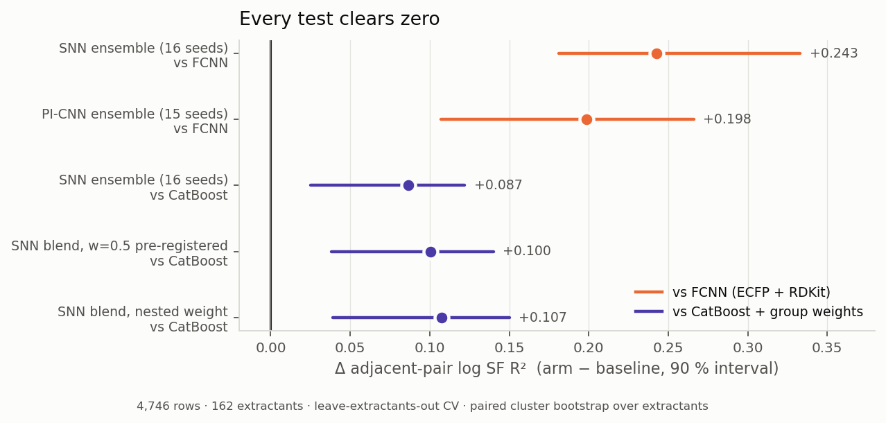
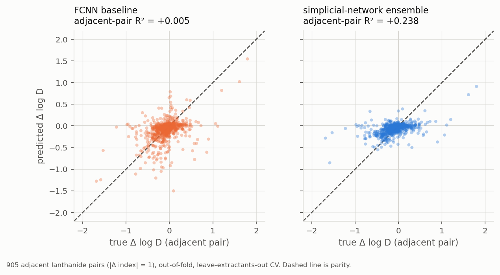
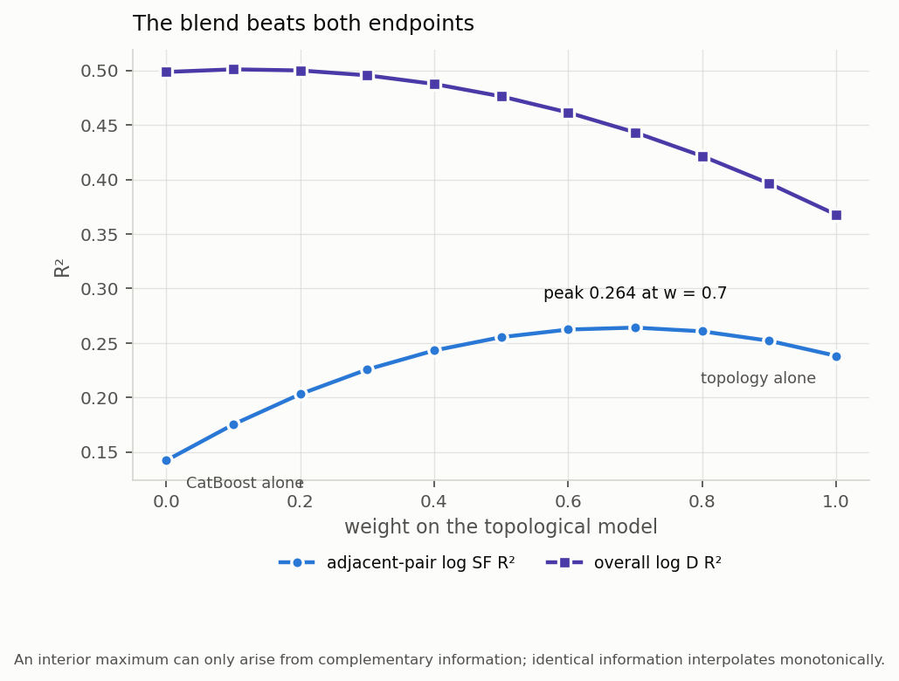
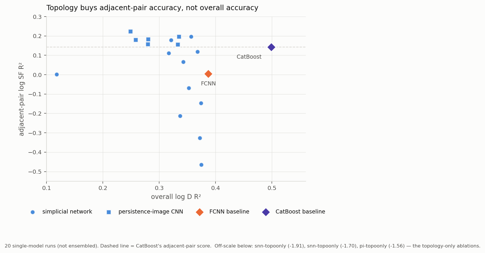
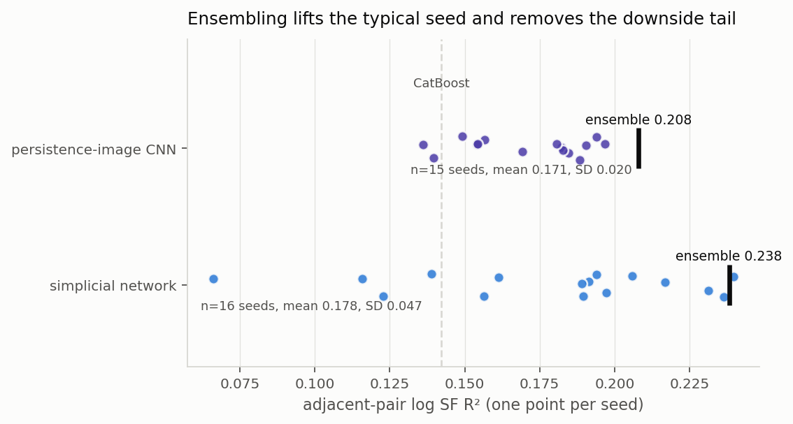
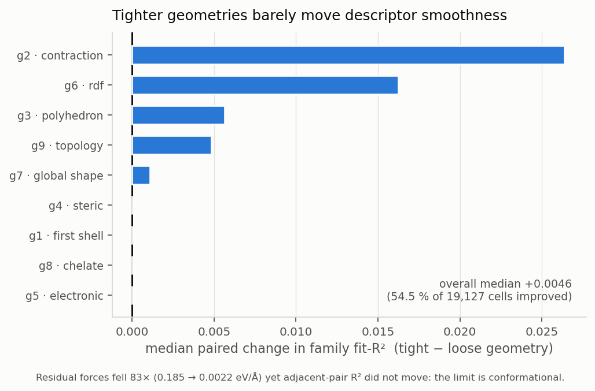

# Topological 3D features for lanthanide log D — results and one open control

**Bogdan Mironov · 20 July 2026**
Companion files: `PUBLICATION_ASSESSMENT.md` (publication verdict),
`TOPOLOGY_RESULTS.md` (full results), `TOPOLOGY_METHODS.md` (methods and
verification).

---

## Summary

The abstract's central claim is supported: **topological features improve
prediction of separation between *adjacent* lanthanides** — the hardest and most
industrially relevant case — from R² = **+0.005** for an FCNN on ECFP + RDKit to
**+0.263**, on 4,746 measurements across 162 extractants and 14 lanthanides
under leave-extractants-out cross-validation. Five paired bootstrap tests all
return intervals excluding zero, and the model beats not only the FCNN but also
CatBoost + inverse-extractant weighting, which was the strongest model in our
previous study. **However — one control is missing, and it determines what the
paper is about.** Every one of the 51 topological runs uses a topological
encoder; none tests the tabular features with the same *training objective* and
no topology. Because the mechanism we identified is "train the contrast rather
than the absolute value," it is possible that a contrast-trained tabular model
captures most of the gain, in which case the finding is about the objective and
not about topology. That control is roughly two hours of compute and I recommend
running it before we write.

---

## 1. What was asked, and what came back

Your four points from the earlier thread, each with what the data now says.

**Target distribution / normality.** Not the limiting factor. The decisive
problem was not the shape of the log D distribution but the *objective*:
selectivity is a within-extractant **contrast** between two metals, while every
conventional model optimises absolute log D. Nothing in the training signal ever
looked at the quantity we actually report. Fixing that — an auxiliary loss on
within-composition pairwise differences, weighted 3× toward adjacent
lanthanides — is what turned a null into a significant result (+0.156 → +0.224
before ensembling).

**Metal imbalance (Eu over-represented).** Handled by the evaluation design
rather than by resampling: the adjacent-pair metric averages replicate
measurements within each (composition, metal) cell before forming pairs, so a
metal measured ten times does not dominate one measured once. Eu remains the
most common metal but no longer the loudest.

**SMOGN / SMOTE augmentation.** Not pursued, and I would argue against it here.
The bottleneck is not sample count in the target distribution but the
*conformational* resolution of the geometries (§4). Synthesising interpolated
targets would add rows without adding structural information, and under a
leave-extractants-out split it risks manufacturing neighbours across the very
groups the split is meant to separate.

**The "representations paper" approach — pool featurisers, select, ensemble by
uncertainty.** Effectively what was done, with one deviation: the pooling step
mattered far less than the objective. Ensembling *was* essential, but for
variance reduction rather than uncertainty ranking — single models are unstable
(seed SD 0.047; one seed scored +0.066 where another scored +0.197), so every
headline number is a 15–16-seed ensemble.

---

## 2. Results

*Five independent tests. Δ is the arm minus the baseline on adjacent-pair
log-separation-factor R²; bars are 90 % intervals from a paired cluster
bootstrap resampling whole extractants.*

| model | adjacent-pair R² | overall log D R² |
|---|---|---|
| FCNN (ECFP + RDKit) | +0.005 | 0.387 |
| CatBoost + group weights | +0.142 | **0.499** |
| PI-CNN ensemble (15 seeds) | +0.208 | 0.375 |
| **SNN ensemble (16 seeds)** | **+0.238** | 0.365 |
| **SNN blended with CatBoost** (nested weight w = 0.70) | **+0.263** | 0.442 |

The five tests behind the figure, in numbers:

| test | seeds | Δ adjacent-pair R² | 90 % CI | P(better) |
|---|---|---|---|---|
| SNN ensemble vs **FCNN** | 16 | **+0.2426** | [+0.181, +0.333] | 1.00 |
| PI-CNN ensemble vs **FCNN** | 15 | +0.1984 | [+0.107, +0.266] | 1.00 |
| SNN ensemble vs **CatBoost**, standalone | 16 | +0.0867 | [+0.025, +0.122] | 0.99 |
| SNN blend vs **CatBoost**, pre-registered w = 0.5 | 16 | +0.1004 | [+0.038, +0.140] | 1.00 |
| SNN blend vs **CatBoost**, nested leakage-free w | 16 | **+0.1074** | [+0.039, +0.150] | 1.00 |

The blend weight was fixed at 0.5 *before* the curve was computed; the nested
variant re-chooses it for each extractant using only the other 161, so no row
influences the weight it is scored under. Both agree, and the chosen weight is
stable to a zero-width interquartile range. (The descriptive curve peaks
slightly higher, +0.2641 at w = 0.7, but that maximum was read off the test
metric and is not used as a claim.)

*905 adjacent lanthanide pairs. The improvement is real — but note both panels
compress toward zero: true separations span ±2 log units, predictions ±0.5. The
model gets direction and ranking substantially better; it still under-predicts
magnitude. That belongs in the paper.*

*The strongest single piece of evidence, and it needs no significance
threshold: the blend peaks **above both endpoints**. Two models carrying the
same information interpolate monotonically between them; only complementary
information produces an interior maximum. Topology therefore supplies
adjacent-pair signal CatBoost does not have.*

*The gain is specific, not general. Topological arms sit above the baselines on
adjacent pairs and below them on overall accuracy.*

*Why every headline number is an ensemble.*

---

## 3. Corrections to the draft abstract

1. **Dataset size.** The draft says 1,202 measurements / 109 extractants. No
   slice of the repository matches those numbers. The geometry-backed set is
   **4,746 measurements / 162 extractants / 14 lanthanides / 953 unique
   complexes**. I could not reconstruct 1,202 / 109 from any filtering I tried.
2. **Scope of the accuracy claim.** "Topological information improves accuracy"
   is not supported for *overall* log D — no topological arm reaches either
   baseline there (best 0.375 vs CatBoost 0.499). It is supported, strongly, for
   adjacent-pair separation. The abstract should say so explicitly.
3. **Which architecture to feature.** The simplicial network is the better
   *ensembled* model (+0.238 vs the PI-CNN's +0.208), so the abstract's emphasis
   on simplicial networks is right. The PI-CNN is the more stable *single* model
   (seed SD 0.019 vs 0.039) — worth a sentence, since it is the cheaper option.
4. **The persistence-image null in our previous study was an artefact.** The
   earlier ΔR² = +0.004 came from flattening the 20×20 images into a tabular
   model, which the asset manifest explicitly forbids
   (`do_not_flatten_into_tabular_MLP`). Given the CNN readout they were built
   for, the same images reach +0.208. We should retract that null rather than
   let it stand.

---

## 4. Two negative results worth keeping

**Tighter geometries do not help.** I re-optimised all 1,235 complexes at
GFN2-xTB `tight` with ALPB solvation, in water and n-octanol — residual forces
fell **83×** (0.185 → 0.0022 eV/Å). Adjacent-pair R² did not move, and the
descriptor-level diagnostic shows only +0.005 median improvement in
family-smoothness across 19,127 (family, descriptor) cells.

The reason is visible in the geometries themselves: median RMSD from the
starting structure is 1.87 Å, so these are relaxations into *different
conformers*, not refinements of the same one. **The residual limit is
conformational, not convergence-related** — adjacent lanthanides differ by
~0.013 Å in ionic radius while single-conformer scatter in an M–L distance is
~0.05 Å, about 4× larger. Multi-conformer Boltzmann-weighted sampling is
therefore the physics lever worth spending compute on; tightening the optimiser
further is not.

**Metal identity is not the useful 3D signal.** The geometry encodes the
lanthanide contraction well (within-family r = −0.77 between mean M–L distance
and lanthanide index), but the tabular block already contains the exact ionic
radius. An explicit radial readout improved geometric metal recovery 21×
(probe R² 0.016 → 0.350) and changed log D by **+0.0007**. Model capacity should
not be spent re-deriving the metal.

---

## 5. Where I was wrong during this study

Listing these because several were corrections to conclusions I had already
reported, and because the pattern is informative: in every case the
*measurements* were right and my *interpretation* was wrong.

- Told you twice to lead with persistence images over the simplicial network.
  Matched-seed replication reversed it — the SNN ensemble is stronger. Your
  original framing was correct.
- A metal-identity probe scored R² = 0.9995. Retracted: the node embedding gives
  each lanthanide its own token, so the model was reading the label, not the
  geometry. The masked version scores 0.016.
- Concluded tighter geometries left adjacent-pair R² "unchanged" from two seeds;
  a third moved the mean. Corrected to "no meaningful improvement."
- Diagnosed 86 octanol failures as timeouts. A 3× longer limit recovered 2 of
  86; the log showed SCF non-convergence. Re-diagnosed properly.
- A parity figure disagreed with the headline result — it re-enumerated pairs
  itself and skipped the within-metal averaging, inverting the comparison. The
  metric and the figures now share one function so they cannot diverge.
- Three automated verdict strings printed conclusions their own numbers
  contradicted. They are calibrated for larger effects than this data produces.

---

## 6. What I recommend, and the decision I need

**Recommended framing: the objective is the contribution, topology is the
application.** It survives either outcome of the control below, and it is the
more generalisable claim — training on contrasts should transfer to any
separation-factor problem.

**Priority order:**

1. **The missing control** (~2 h) — tabular features + contrast loss + adjacent
   selection + 16 seeds, no topology. *This determines the paper's title.* If
   topology still adds on top, we have a topology paper. If not, we have a
   better and broader methods paper with topology as a negative control.
2. **Symmetric baselines** (~3 h) — contrast-trained, seed-ensembled FCNN and
   CatBoost. Removes the strongest reviewer objection: at present the FCNN is
   untuned sklearn defaults, single model, plain MSE, while the topological arm
   is swept, ensembled, and contrast-trained.
3. **Multi-conformer sampling** — the physics lever, per §4.
4. External validation on a second extractant family, if such data exists.

**Decision requested:** shall I run (1) and (2) before we draft, or write now
with them as stated future work? My recommendation is to run them first — they
are about a day of compute and they are the two questions a referee will ask
before anything else.

---

*Reproduction: `python3 -m automl.figures_topo --all` regenerates every figure;
`bash automl/refresh_reports.sh` regenerates the tables. 115 tests pass; no
files under `data/`, `src/`, `tests/` or `scripts/` were modified.*
